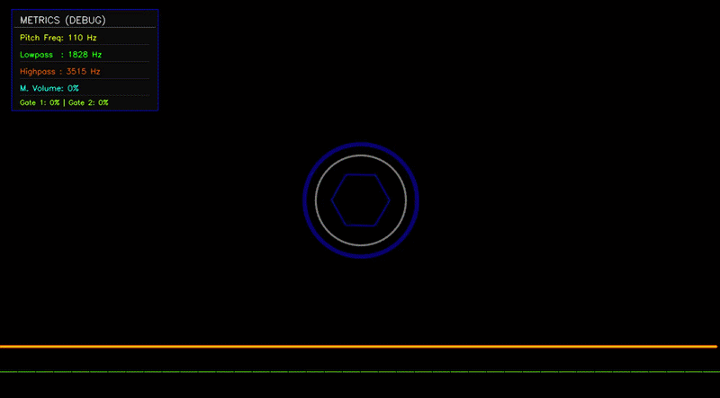

# WAVNER

## Description
WAVNER is an interactive, computer-vision-based audio synthesizer. It acts as a "Theremin-like" instrument that allows users to modulate audio signals, control volume, and apply effects in real time using hand gestures captured by a webcam. The project leverages MediaPipe for robust hand tracking and PyAudio for real-time audio processing.



## Features
- Real-time hand tracking and gesture recognition via webcam.
- Dynamic waveform generation: Sine, Square, Triangle, and Sawtooth.
- Hand-controlled audio modulation:
  - Right Hand: Tone control, Lowpass filter (thumb and index), and Highpass filter (middle, ring, and pinky).
  - Left Hand: Volume control, Reverb effect (thumb), Distortion effect (index), and multi-channel audio gating.
- Multi-channel audio engine and mixing capabilities.
- Real-time aesthetic audio visualizer.

## Requirements
- Python 3.8 or higher
- opencv-python
- mediapipe
- numpy
- pyaudio
- librosa

## Installation
1. Clone the repository to your local machine.
2. Install the required dependencies using pip:
   ```bash
   pip install opencv-python mediapipe numpy pyaudio librosa
   ```

## Usage
Run the main script to start the synthesizer engine:
```bash
python wavner.py
```

To enable the camera preview window for debugging hand tracking and visual metrics, use the `--show-camera` flag:
```bash
python wavner.py --show-camera
```

### Controls
- Hand Gestures: Use your left and right hands to modulate the sound, apply effects, and control volume.
- Keyboard: Use keys `1`, `2`, `3`, and `4` to switch the active waveform types dynamically during runtime.